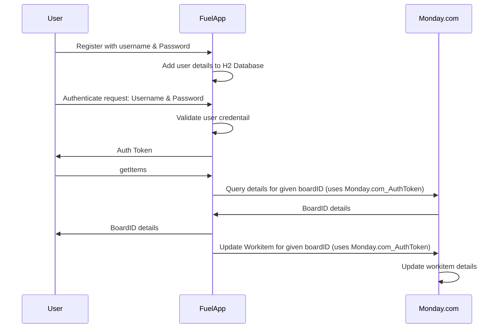

# Test_project

```mermaid
sequenceDiagram
    participant User
    participant FuelApp
    participant Monday.com
    User->>FuelApp: Register with username & Password
    FuelApp->>FuelApp: Add user details to H2 Database
    User->>FuelApp: Authenticate request: Username & Password
    FuelApp->>FuelApp: Validate user credentail 
    FuelApp->>User: Auth Token
    User->>FuelApp: getItems 
    FuelApp->>Monday.com: Query details for given boardID (uses Monday.com_AuthToken)
    Monday.com->>FuelApp: BoardID details
    FuelApp->>User: BoardID details
    FuelApp->>Monday.com: Update Workitem for given boardID (uses Monday.com_AuthToken)
    Monday.com->>Monday.com: Update workitem details
```
