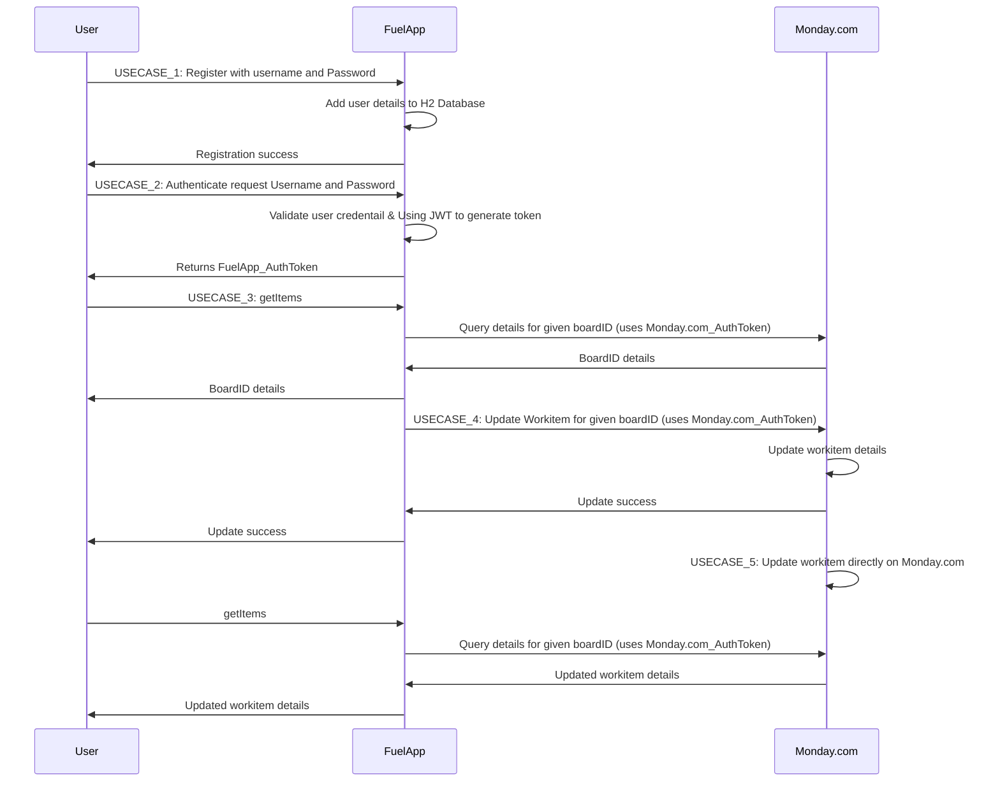

# Test_project

```mermaid
sequenceDiagram
    participant User
    participant FuelApp
    participant Monday.com
    User->>FuelApp: USECASE_1: Register with username and Password
    FuelApp->>FuelApp:Add user details to H2 Database
    FuelApp->>User:Registration success
    User->>FuelApp: USECASE_2: Authenticate request Username and Password
    FuelApp->>FuelApp: Validate user credentail  &  Using JWT to generate token
    FuelApp->>User:Returns FuelApp_AuthToken
    User->>FuelApp: USECASE_3: getItems 
    FuelApp->>Monday.com: Query details for given boardID (uses Monday.com_AuthToken)
    Monday.com->>FuelApp: BoardID details
    FuelApp->>User: BoardID details
    FuelApp->>Monday.com: USECASE_4: Update Workitem for given boardID (uses Monday.com_AuthToken)
    Monday.com->>Monday.com: Update workitem details
    Monday.com->>FuelApp: Update success
    FuelApp->>User:Update success
    Monday.com->>Monday.com: USECASE_5: Update workitem directly on Monday.com
    User->>FuelApp:getItems
    FuelApp->>Monday.com:Query details for given boardID (uses Monday.com_AuthToken)
    Monday.com->>FuelApp:Updated workitem details
    FuelApp->>User:Updated workitem details
```
